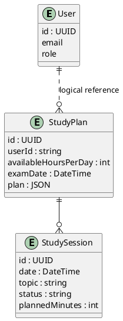
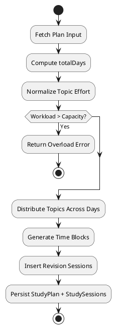
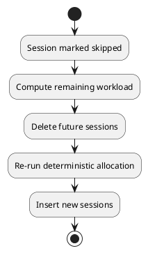

# SPEC-1-AI-Exam-Scheduler

## Background

Students preparing for high-stakes examinations (university finals, school boards, competitive exams like JEE/NEET/UPSC) face a constrained time window with uneven syllabus distribution and varying subject difficulty. In the final 30–90 days, poor time allocation and lack of structured revision significantly reduce performance.

Current behavior patterns:

- Over-indexing on strong or favorite subjects
- Underestimating topic depth and revision needs
- No systematic feedback loop when falling behind
- High cognitive load in daily planning decisions

The proposed system is an AI-assisted study scheduling backend that:

- Converts exam metadata and syllabus structure into a structured daily study plan
- Enforces balanced distribution across subjects
- Embeds revision cycles automatically
- Adapts dynamically based on execution data

The system acts as a time-allocation optimizer with deterministic guardrails and AI-assisted planning refinement.

---

## Requirements

### Must Have (MVP – Beta, Self-Study Only)

- User can create a study plan with:
  - Exam name
  - Target exam date
  - Subjects (with optional topic list)
  - Available study hours per day

- System generates:
  - Topic-wise daily schedule
  - Time blocks per day
  - Balanced subject distribution
  - Built-in spaced revision slots

- Session tracking:
  - Status: pending / completed / skipped
  - Optional remarks

- Deterministic constraint validation:
  - Total daily hours ≤ available hours
  - No overlapping sessions
  - Exam date strictly enforced

- Strict authentication (JWT-based, enforced at gateway)
- Structured AI output validation (Zod schema)
- Observability:
  - Correlation ID per request
  - Structured logging

### Should Have (v1 Stable)

- Strength/weakness weighting per subject
- Automatic redistribution if sessions are skipped
- Coverage analytics:
  - % syllabus covered
  - Days remaining vs workload remaining

- Retry + exponential backoff for AI failures
- Idempotent plan generation endpoint

### Could Have (v2 Adaptive)

- Performance-based adaptation (speed factor per user)
- Rolling horizon rescheduling (only future days recomputed)
- Study velocity estimation
- Smart revision intensity adjustment
- Topic difficulty scoring

### Won’t Have (For Now)

- Coaching institute multi-user batch scheduling
- Real-time collaborative study planning
- Offline-first mode
- Native mobile-specific optimization logic

---

## Architectural Decision (AI vs Deterministic Logic)

Based on the provided code:

Current state:

- AI fully generates schedule structure (days + sessions)
- Backend mainly validates and persists
- No deterministic time allocation engine exists

Risk:

- Non-reproducible schedules
- Hard to debug distribution logic
- Difficult to enforce strict constraints
- Hard to adapt deterministically on missed sessions

Recommended Architecture Shift (Starting MVP Refactor):

- AI Responsibilities:
  - Suggest topic breakdown ordering
  - Estimate topic effort (light / medium / heavy)
  - Suggest revision frequency heuristics

- Deterministic Engine Responsibilities:
  - Compute day count = examDate - today
  - Compute total available hours
  - Allocate weighted subject distribution
  - Insert revision blocks at fixed intervals (e.g., 3-7-14 spacing)
  - Generate exact time blocks
  - Handle all adaptive rescheduling

Conclusion:
→ AI should NOT generate the final schedule structure.
→ AI should assist in heuristic estimation only.
→ Final schedule must be generated deterministically.

This ensures reproducibility, debuggability, and scalable adaptation.

---

## Domain Model (Aligned With Current MVP Schema)

Your current Prisma schema is simpler and AI-centric. For MVP (beta), we will align with it and introduce minimal corrections only where necessary.

---

### Final MVP Domain Model (Service Boundaries Preserved)

### User Service (Owns User Domain)

Entity: User

- id (UUID)
- email (unique)
- name
- password
- role
- isActive
- isVerified
- createdAt
- updatedAt

(User service does NOT enforce FK in StudyPlan service — correct microservice boundary decision.)

---

### AI Schedule Service

### 1. StudyPlan

Current Schema (Adjusted Slightly for Deterministic Evolution):

- id (UUID)
- userId (string, indexed)
- subjects (String[]) → MVP simplification
- availableHoursPerDay (Int)
- targetCompletionDate (DateTime)
- plan (Json) → Generated deterministic schedule snapshot
- createdAt
- updatedAt

sessions → relation to StudySession

Indexes:

- userId
- userId + createdAt

✅ This is valid for MVP.

Recommended Minor Improvements:

- Rename targetCompletionDate → examDate (semantic clarity)
- Add isActive Boolean (default true)

---

### 2. StudySession

Current Schema (Mostly Correct):

- id (UUID)
- studyPlanId (FK)
- date (String ISO) ⚠ recommend DateTime
- topic (String)
- startTime (String HH:mm)
- endTime (String HH:mm)
- status (pending | completed | skipped)
- remarks (nullable)
- createdAt
- updatedAt

Indexes:

- studyPlanId
- date
- status
- studyPlanId + status

---

### Required Schema Corrections (Minimal but Important)

1️⃣ Keep:

```
date DateTime
```

Reason:

- Prisma natively supports `DateTime` with PostgreSQL `timestamptz`
- Prisma stores and returns UTC by default — no ambiguity
- Range queries (`gte`, `lte`) work directly on DateTime fields
- Cleaner DX — no manual conversion between Unix ints and dates
- Prisma's type system ensures type safety across the stack

Important Rule:

- Prisma DateTime is stored as UTC in PostgreSQL
- Convert to local timezone at API boundary only

This is fully compatible with deterministic scheduling logic.

2️⃣ Add:

```
plannedMinutes Int
completedMinutes Int?
isRevision Boolean @default(false)
```

This allows:

- Partial completion tracking
- Adaptive redistribution
- Revision tagging

---

## Updated ER Diagram (Matching Your Microservice Schema)



---

Important Architectural Note:

For MVP, Topics and Subjects remain embedded in:

- StudyPlan.subjects (string[])
- StudySession.topic (string)

We will NOT normalize Subject/Topic tables until v2.

This keeps:

- Migration complexity low
- AI schema simple
- Deterministic allocation manageable

---

Next Section: Algorithmic Schedule Generation Engine

---

## Method

### Deterministic Scheduling Engine (MVP)

Inputs:

- examDate (DateTime, UTC)
- availableHoursPerDay
- preferredStartTime (default 08:00)
- subjects[]
- topic list (from AI ordering heuristic)

Derived Values:

- today = current UTC midnight (DateTime)
- totalDays = differenceInCalendarDays(examDate, today)
- dailyAvailableMinutes = availableHoursPerDay \* 60

---

### Step 1: Topic Effort Normalization

AI returns per-topic:

- estimatedHours
- difficulty (easy/medium/hard)

Engine converts to:

normalizedWeight = estimatedHours \* difficultyMultiplier

Where:

- easy = 1.0
- medium = 1.25
- hard = 1.5

Total workloadMinutes = Σ (normalizedWeight \* 60)

---

### Step 2: Daily Allocation Capacity

Total capacityMinutes = totalDays \* dailyAvailableMinutes

If workloadMinutes > capacityMinutes:
→ System returns "Overloaded Plan" error
→ Suggest increased daily hours or extended date

---

### Step 3: Balanced Distribution (Round-Robin Weighted)

Algorithm:

1. Sort topics by descending normalizedWeight
2. Maintain min-heap of day loads
3. Assign next topic chunk to least-loaded day
4. Split large topics across multiple days if needed

This ensures:

- Balanced subject distribution
- No day overload
- Deterministic output

---

### Step 4: Time Block Generation

For each day:

startTime = preferredStartTime

While remainingMinutes > 0:

- sessionLength = min(90, remainingMinutes)
- Add 10-minute break after each session (except last)
- Increment time pointer

Rules:

- Max continuous session = 90 minutes
- Minimum session = 30 minutes
- No overlapping blocks

---

### Step 5: Fixed Revision Insertion (MVP)

For each topic completion day D:

Insert revision sessions at:

- D + 3 days
- D + 7 days
- D + 14 days

Revision duration:

- 25% of original topic minutes

Mark session:

- isRevision = true

If revision day exceeds examDate → ignore

---

## Scheduling Flow Diagram



---

### AI vs Engine Responsibility Split

AI:

- Topic ordering
- Effort estimation
- Difficulty tagging

Engine:

- Capacity math
- Distribution
- Revision insertion
- Time block creation
- Rescheduling

---

Next: Adaptive Rescheduling Strategy

---

## Adaptive Rescheduling Strategy (Confirmed Behavior)

Requirement:

- When a session is marked "skipped" or partially completed
- The exam date must NOT change
- The end date must NEVER be pushed
- Remaining workload must be redistributed evenly across remaining future days

This is a constrained re-optimization problem.

---

### Trigger Condition

On session status change to:

- skipped
- partial (completedMinutes < plannedMinutes)

---

### Step 1: Compute Remaining Workload

For the affected StudyPlan:

remainingMinutes =
Σ (topic.totalAllocatedMinutes - topic.totalCompletedMinutes)
for all topics

remainingDays =
floor((examDate - today) / 86400)

remainingCapacityPerDay = availableHoursPerDay \* 60

If remainingMinutes > remainingDays \* remainingCapacityPerDay:
→ Mark plan as "At Risk"
→ Surface alert via API

---

### Step 2: Even Redistribution (Deterministic)

Algorithm:

1. Delete all future sessions (date >= tomorrow)
2. Recompute distribution using same deterministic engine
3. Only include remaining workload
4. Preserve completed sessions (immutable history)

Key Rule:

- Past sessions are never modified
- Future schedule is fully regenerated
- Exam date remains fixed

This guarantees:

- Even distribution
- No bias toward next immediate day
- No silent overload accumulation
- Predictable behavior

---

### Optimization Strategy

To avoid full plan recalculation overhead:

- Only regenerate sessions where date >= tomorrow
- Use idempotent transaction block
- Wrap in DB transaction

Pseudo-flow:



---

Complexity:

- O(n log d)
  where n = topics, d = remaining days

This is acceptable for:

- < 200 topics
- < 180 days horizon

---

Next Section: Implementation

---

## Implementation

### Architecture Additions for Async Rescheduling

Add Component:

- Reschedule Worker (Background Processor)
- Redis-based queue (BullMQ recommended)

Flow:

1. updateSessionStatus API
   - Update DB status
   - Publish job: "RESCHEDULE_PLAN" with studyPlanId
   - Return immediately (non-blocking)

2. Worker Service
   - Consume job
   - Run adaptive redistribution algorithm
   - Use DB transaction:
     - Delete future sessions
     - Recompute allocation
     - Insert new sessions

   - Emit structured log with correlationId

---

### Updated System Architecture

```plantuml
@startuml
actor User

User -> API Gateway
API Gateway -> AI Schedule Service
AI Schedule Service -> PostgreSQL
AI Schedule Service -> Redis : enqueue job

Redis -> Reschedule Worker
Reschedule Worker -> PostgreSQL

@enduml
```

---

### Technology Decisions

Queue: BullMQ (Node.js + Redis)
Reason:

- Mature
- Retry with exponential backoff
- Job deduplication
- Delayed jobs support

Retry Strategy:

- maxAttempts: 5
- backoff: exponential (2^n \* 1000ms)

Idempotency:

- Job key = studyPlanId + timestamp
- If job already running → discard duplicate

---

### Transaction Safety

All rescheduling logic wrapped in:

```
prisma.$transaction(async (tx) => {
  // delete future sessions
  // recompute
  // bulk insert
});
```

Guarantees:

- No partial regeneration
- No inconsistent future schedule

---

## Milestones

### Phase 1 — MVP (Beta: Self-Study Only)

Goal: Deterministic engine + AI-assisted heuristics + async rescheduling

Deliverables:

- Deterministic schedule generation engine
- AI heuristic estimation (effort + difficulty only)
- Prisma DateTime-based session storage (UTC)
- StudySession tracking (pending/completed/skipped/partial)
- Async rescheduling worker (BullMQ)
- Overload detection (capacity validation)
- Basic coverage analytics (% completed vs total)
- Structured logging + correlation IDs

Success Criteria:

- Plan generation < 2s (excluding AI latency)
- Reschedule job < 3s for ≤150 topics
- No overlapping sessions ever
- Deterministic reproducibility (same input → same schedule)

---

### Phase 2 — Stable v1

Goal: Production hardening + analytics maturity

Enhancements:

- Strength/weakness weighting input
- "At Risk" plan status
- Velocity metric (minutes completed / day)
- Idempotent plan regeneration endpoint
- Improved observability (metrics: queue time, job duration)
- Plan versioning (store generation hash)
- Soft-delete plans

Success Criteria:

- <1% failed reschedule jobs
- Clear risk signaling before overload
- Dashboard-ready analytics endpoints

---

### Phase 3 — Adaptive v2

Goal: Performance-aware intelligent adaptation

Enhancements:

- Dynamic revision intervals (difficulty + performance based)
- Topic difficulty auto-adjustment
- Rolling-horizon scheduling (regenerate next N days only)
- Study velocity prediction
- AI-assisted risk forecasting
- Optional coaching-mode multi-tenant extension

Success Criteria:

- Measurable improvement in completion adherence
- Lower "at risk" rates
- Reduced daily workload variance

---

## Gathering Results

### Metrics to Track

Product Metrics:

- Daily completion rate (%)
- Plan adherence ratio
- Sessions skipped per week
- Revision compliance rate
- Plan overload frequency

System Metrics:

- Schedule generation latency
- Reschedule job duration
- Queue depth
- DB transaction time
- AI API failure rate

---

### Post-Production Validation

1. Compare planned vs actual completion velocity
2. Measure distribution fairness (std deviation of daily load)
3. Detect subject imbalance trends
4. Evaluate reschedule frequency per user

---

## Need Professional Help in Developing Your Architecture?

Please contact me at [sammuti.com](https://sammuti.com) :)
