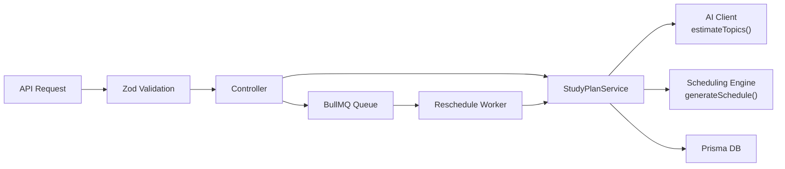

# MVP Walkthrough: Deterministic Scheduling Engine

## Changes Made

### New Files (5)

| File                                                                                                                                           | Purpose                                                      |
| ---------------------------------------------------------------------------------------------------------------------------------------------- | ------------------------------------------------------------ |
| [schedulingEngine.ts](file:///c:/Users/Gaurav/projects/AI-Study-Planner/services/ai-schedule-service/src/services/schedulingEngine.ts)         | **Core deterministic engine** — 7 pure functions, ~300 lines |
| [rescheduleQueue.ts](file:///c:/Users/Gaurav/projects/AI-Study-Planner/services/ai-schedule-service/src/queues/rescheduleQueue.ts)             | BullMQ queue with dedup + exponential backoff                |
| [rescheduleWorker.ts](file:///c:/Users/Gaurav/projects/AI-Study-Planner/services/ai-schedule-service/src/workers/rescheduleWorker.ts)          | Background worker consuming reschedule jobs                  |
| [correlationId.ts](file:///c:/Users/Gaurav/projects/AI-Study-Planner/services/ai-schedule-service/src/middleware/correlationId.ts)             | Request tracing via `X-Correlation-ID` header                |
| [schedulingEngine.test.ts](file:///c:/Users/Gaurav/projects/AI-Study-Planner/services/ai-schedule-service/tests/unit/schedulingEngine.test.ts) | 25+ unit tests for all engine functions                      |

### Modified Files (7)

| File                                                                                                                                            | What Changed                                                                                                                                 |
| ----------------------------------------------------------------------------------------------------------------------------------------------- | -------------------------------------------------------------------------------------------------------------------------------------------- |
| [schema.prisma](file:///c:/Users/Gaurav/projects/AI-Study-Planner/services/ai-schedule-service/prisma/schema.prisma)                            | Added `isActive`, `examName`, `preferredStartTime`, `plannedMinutes`, `completedMinutes`, `isRevision`; changed session `date` to `DateTime` |
| [ai-api-client.ts](file:///c:/Users/Gaurav/projects/AI-Study-Planner/services/ai-schedule-service/src/services/ai-api-client.ts)                | Narrowed to `estimateTopics()` — AI only provides topic breakdown + difficulty                                                               |
| [studyPlanService.ts](file:///c:/Users/Gaurav/projects/AI-Study-Planner/services/ai-schedule-service/src/services/studyPlanService.ts)          | Full refactor: AI→engine→persist flow, `reschedule()`, `getCoverageAnalytics()`, async trigger                                               |
| [schemas/index.ts](file:///c:/Users/Gaurav/projects/AI-Study-Planner/services/ai-schedule-service/src/schemas/index.ts)                         | New Zod schemas for all MVP endpoints                                                                                                        |
| [studyPlanController.ts](file:///c:/Users/Gaurav/projects/AI-Study-Planner/services/ai-schedule-service/src/controllers/studyPlanController.ts) | 8 handlers including analytics and manual reschedule                                                                                         |
| [studyPlanRoutes.ts](file:///c:/Users/Gaurav/projects/AI-Study-Planner/services/ai-schedule-service/src/routes/studyPlanRoutes.ts)              | 7 routes: list, generate, get, update, delete, reschedule, analytics (all behind JWT auth)                                                   |
| [index.ts](file:///c:/Users/Gaurav/projects/AI-Study-Planner/services/ai-schedule-service/src/index.ts)                                         | Registered correlation ID middleware, starts BullMQ worker on boot                                                                           |

---

## Architecture Change



**Before**: AI generated the entire schedule JSON → backend just persisted it.
**After**: AI estimates topics only → deterministic engine computes schedule → backend persists structured sessions.

---

## Manual Steps Required

> [!IMPORTANT]
> Terminal commands were hanging in the dev environment. Run these manually:

### 1. Install new dependencies

```bash
cd services/ai-schedule-service
npm install bullmq ioredis
```

### 2. Generate Prisma client

```bash
npx prisma generate
```

### 3. Run migration

```bash
npx prisma migrate dev --name mvp-deterministic-engine
```

### 4. Type check

```bash
npx tsc --noEmit
```

### 5. Run scheduling engine tests

```bash
npx jest tests/unit/schedulingEngine.test.ts
```

---

## API Endpoints (MVP)

| Method   | Path                           | Description                           |
| -------- | ------------------------------ | ------------------------------------- |
| `POST`   | `/api/v1/plans/generate`       | Generate study plan (AI + engine)     |
| `GET`    | `/api/v1/plans`                | List all plans for authenticated user |
| `GET`    | `/api/v1/plans/:id`            | Get plan with sessions                |
| `PUT`    | `/api/v1/plans/:id`            | Update plan metadata                  |
| `DELETE` | `/api/v1/plans/:id`            | Delete plan + sessions                |
| `POST`   | `/api/v1/plans/:id/reschedule` | Trigger async reschedule (202)        |
| `GET`    | `/api/v1/plans/:id/analytics`  | Coverage analytics + at-risk          |
| `PATCH`  | `/api/v1/sessions/:id/status`  | Update session status                 |
| `PATCH`  | `/api/v1/sessions/:id/remarks` | Update session remarks                |
