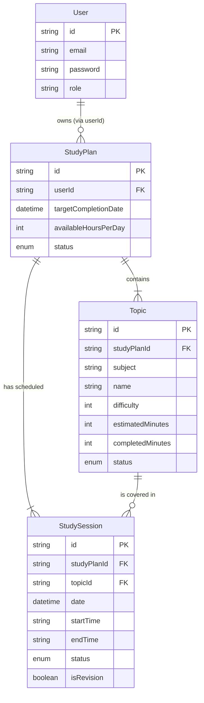

# Data Model & Schema Specification

## Domain Model Overview

The domain model is split across two microservices, strictly enforcing the "Database per Service" pattern.



## User Service Schema

Located in: `services/user-service/prisma/schema.prisma`

```prisma
generator client {
  provider = "prisma-client-js"
}

datasource db {
  provider = "postgresql"
  url      = env("DATABASE_URL")
}

model User {
  id          String      @id @default(uuid())
  email       String      @unique
  password    String      // Hashed
  firstName   String?
  lastName    String?
  role        UserRole    @default(USER)
  isActive    Boolean     @default(true)
  isVerified  Boolean     @default(false)

  lastLoginAt DateTime?
  createdAt   DateTime    @default(now())
  updatedAt   DateTime    @updatedAt

  @@index([email])
  @@map("users")
}

enum UserRole {
  USER
  ADMIN
}
```

## AI Schedule Service Schema

Located in: `services/ai-schedule-service/prisma/schema.prisma`

Key refinements from original MVP:
- **Topic Model**: Explicitly tracks metadata (difficulty, estimation) and progress per topic.
- **Session Linking**: Sessions are now linked to `Topic` for granular analytics.
- **Enums**: Strict status tracking for Plan, Topic, and Session.
- **RevisionType**: Differentiates between new learning and spaced repetition.

```prisma
generator client {
  provider = "prisma-client-js"
}

datasource db {
  provider = "postgresql"
  url      = env("DATABASE_URL")
}

// --------------------------------------------------------
// STUDY PLAN AGGREGATE
// --------------------------------------------------------

model StudyPlan {
  id                    String      @id @default(uuid())
  userId                String      // Reference to User Service ID

  examName              String?
  targetCompletionDate  DateTime    // UTC Midnight
  startDate             DateTime    @default(now()) // UTC Midnight

  availableHoursPerDay  Int         // Constraint: Max daily study time
  preferredStartTime    String      @default("08:00") // HH:mm format

  status                PlanStatus  @default(ACTIVE)

  createdAt             DateTime    @default(now())
  updatedAt             DateTime    @updatedAt

  topics                Topic[]
  sessions              StudySession[]

  @@index([userId])
  @@index([status])
  @@map("study_plans")
}

enum PlanStatus {
  ACTIVE
  COMPLETED
  FAILED      // Overload or technical failure
  ARCHIVED
}

// --------------------------------------------------------
// TOPIC METADATA
// --------------------------------------------------------

model Topic {
  id                    String      @id @default(uuid())
  studyPlanId           String
  studyPlan             StudyPlan   @relation(fields: [studyPlanId], references: [id], onDelete: Cascade)

  subject               String      // e.g., "Mathematics"
  name                  String      // e.g., "Calculus: Limits"

  difficulty            Int         @default(3) // 1-5 Scale (Heuristic for scheduling weight)
  estimatedMinutes      Int         // Total required time (AI estimated or user provided)

  completedMinutes      Int         @default(0) // Aggregated from completed sessions

  status                TopicStatus @default(PENDING)

  createdAt             DateTime    @default(now())
  updatedAt             DateTime    @updatedAt

  sessions              StudySession[]

  @@index([studyPlanId])
  @@map("topics")
}

enum TopicStatus {
  PENDING
  IN_PROGRESS
  COMPLETED
}

// --------------------------------------------------------
// SCHEDULED SESSIONS
// --------------------------------------------------------

model StudySession {
  id               String        @id @default(uuid())
  studyPlanId      String
  studyPlan        StudyPlan     @relation(fields: [studyPlanId], references: [id], onDelete: Cascade)

  topicId          String?
  topic            Topic?        @relation(fields: [topicId], references: [id], onDelete: SetNull)

  date             DateTime      // UTC Midnight of the scheduled day
  startTime        String        // "HH:mm" (24h)
  endTime          String        // "HH:mm" (24h)
  durationMinutes  Int           // Planned duration

  isRevision       Boolean       @default(false)
  revisionType     RevisionType? // NEW_TOPIC vs SPACED_REPETITION

  status           SessionStatus @default(PENDING)

  completedMinutes Int?          // Actual time logged by user
  remarks          String?       // User notes

  createdAt        DateTime      @default(now())
  updatedAt        DateTime      @updatedAt

  @@index([studyPlanId, date])    // Critical for fetching daily schedule
  @@index([studyPlanId, status])  // Critical for analytics & rescheduling
  @@map("study_sessions")
}

enum SessionStatus {
  PENDING
  COMPLETED
  SKIPPED
  PARTIAL
}

enum RevisionType {
  NEW_TOPIC
  REV_3_DAYS
  REV_7_DAYS
  REV_14_DAYS
}
```
