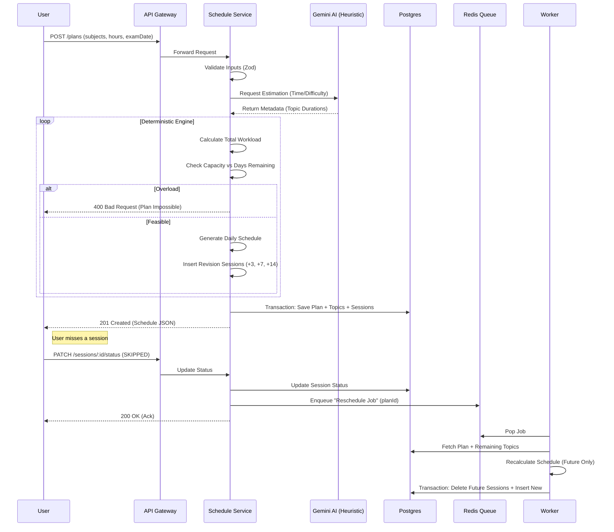

# Research & Algorithms

## Service Interaction Diagram



## Scheduling Algorithm (Pseudocode)

### 1. Initial Plan Generation

**Goal**: Transform a list of topics into a calendar schedule with spaced repetition.

```python
function generateSchedule(planConfig, topics):
    # 1. Validation
    totalMinutesNeeded = sum(topic.estimatedMinutes for topic in topics)
    daysRemaining = diffDays(planConfig.startDate, planConfig.examDate)
    dailyCapacity = planConfig.availableHoursPerDay * 60

    if totalMinutesNeeded > (daysRemaining * dailyCapacity):
        throw Error("Workload exceeds capacity")

    # 2. Initialization
    schedule = Map<Date, Session[]>()
    currentDate = planConfig.startDate
    topicQueue = sortTopicsByPriority(topics) # High difficulty first?
    revisionQueue = PriorityQueue() # Orders revisions by due date

    # 3. Allocation Loop
    while (topicQueue.isNotEmpty() OR revisionQueue.isNotEmpty()):
        daySlots = initializeDay(currentDate, planConfig.startTime, dailyCapacity)

        # A. Prioritize Revisions (Spaced Repetition)
        while (revisionQueue.hasDue(currentDate) AND daySlots.hasSpace()):
            rev = revisionQueue.pop()
            session = createSession(rev, duration=rev.duration * 0.25)
            daySlots.add(session)

        # B. Fill Remaining Time with New Topics
        while (daySlots.hasSpace() AND topicQueue.isNotEmpty()):
            topic = topicQueue.peek()
            remainingTime = topic.remainingTime
            allocatableTime = min(remainingTime, 90, daySlots.remaining())

            session = createSession(topic, duration=allocatableTime)
            daySlots.add(session)

            topic.remainingTime -= allocatableTime
            if topic.remainingTime <= 0:
                topicQueue.pop()
                # Schedule Revisions
                scheduleRevision(revisionQueue, topic, currentDate + 3)
                scheduleRevision(revisionQueue, topic, currentDate + 7)
                scheduleRevision(revisionQueue, topic, currentDate + 14)

        # C. Advance Day
        schedule.put(currentDate, daySlots)
        currentDate = currentDate + 1

        if currentDate > planConfig.examDate:
             throw Error("Impossible to fit schedule by exam date")

    return schedule
```

### 2. Adaptive Rescheduling

**Trigger**: Session status changes to `SKIPPED` or `PARTIAL`.

```python
function reschedule(planId):
    # 1. Fetch State
    plan = DB.getPlan(planId)
    futureSessions = DB.getSessions(planId, date > today)
    incompleteTopics = DB.getTopics(planId, status != COMPLETED)

    # 2. Reset Future State
    # We treat all "future" allocated time as "back in the pool"
    # But we must preserve "past" progress.

    workloadPool = []
    for topic in incompleteTopics:
        # Calculate how much is left based on PAST completed sessions only
        completedPast = DB.sumSessionDuration(topic.id, status=COMPLETED)
        remaining = topic.totalEstimated - completedPast
        if remaining > 0:
            workloadPool.add({ topic, remaining })

    # 3. Regenerate
    # Use the same engine as Initial Generation, but start from Tomorrow
    newSchedule = generateSchedule({
        startDate: today + 1,
        examDate: plan.examDate, # NEVER EXTEND
        ...planConfig
    }, workloadPool)

    # 4. Atomic Swap
    DB.transaction(() => {
        DB.deleteSessions(planId, date > today)
        DB.insertSessions(newSchedule)
    })
```

## Failure Mode Analysis

| Component | Failure Scenario | Detection | Mitigation |
|-----------|------------------|-----------|------------|
| **AI Heuristic** | Timeout (>8s) or 500 Error | Exception in Service | **Circuit Breaker**: Fallback to default heuristic (e.g., 60 mins per topic, medium difficulty). Retry 3x with backoff. |
| **Database** | Connection Pool Exhaustion | Connection Timeout | **Rate Limiting**: Gateway limits requests. **Read Replicas** for Analytics queries (future). |
| **Reschedule Job** | Worker Crash / OOM | Job Stalled in Redis | **BullMQ Retry**: Auto-retry failed jobs. **Dead Letter Queue** after 3 attempts. |
| **Scheduler** | "Impossible Plan" (Overload) | Algorithm Exception | **Graceful Rejection**: Return 400 to user with "Reduce topics or increase daily hours". **Do NOT** extend exam date. |

## Load Test Assumptions

**Target**: 10k Concurrent Active Users (CAU)
- **Active User Definition**: 1 plan generation or 5 session updates per day.
- **Traffic Profile**:
    - **Plan Generation**: Heavy write, rare (1/user/month).
        - 10k users * 1 gen / 30 days = ~333 gens/day = ~0.004 RPS (Negligible)
        - *Peak Burst*: New academic year (10x) = 0.04 RPS.
    - **Session Updates (Rescheduling)**: Frequent (5/user/day).
        - 10k * 5 = 50k updates/day = ~0.6 RPS.
        - *Peak Burst* (Evening study time): 10x = 6 RPS.
    - **Read Analytics**: Very Frequent (10/user/day).
        - 100k reads/day = ~1.2 RPS.
        - *Peak*: 12 RPS.

**Conclusion**: The load is strictly **CPU-bound** on the Scheduling Engine (Node.js) and **IO-bound** on DB writes.
- **Node.js**: 6 RPS for rescheduling is trivial for a single instance, but complex algorithm might take 50ms CPU time. 6 * 50ms = 300ms (30% core load). Safe.
- **Postgres**: Transactional writes for rescheduling (Delete + Insert 50 rows) = ~1000 row writes/sec peak. Manageable with standard instances.
